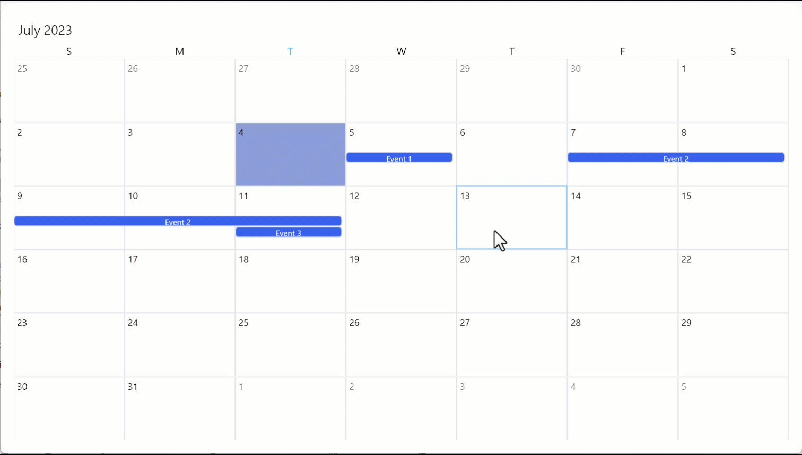
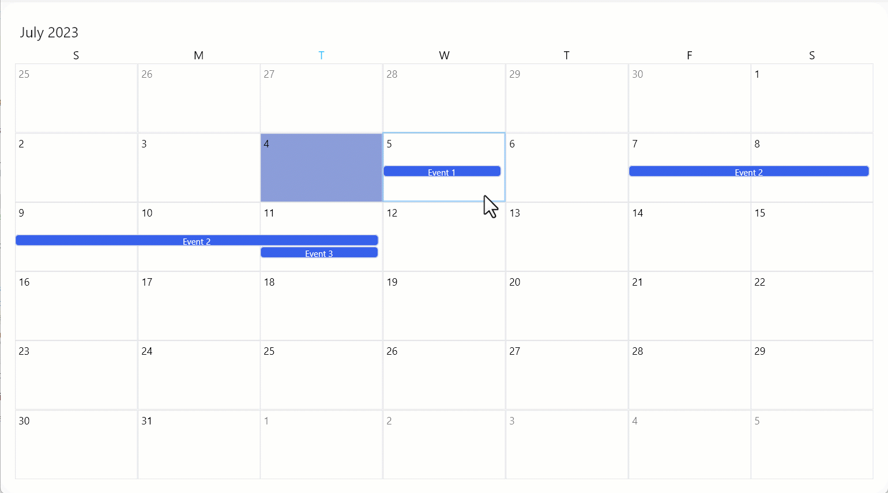
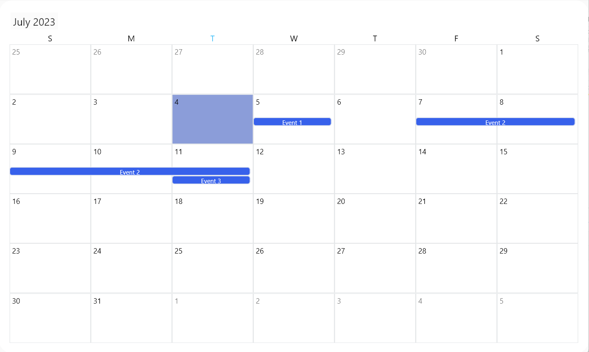
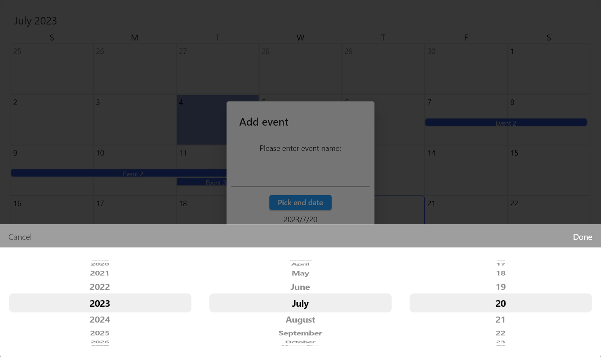
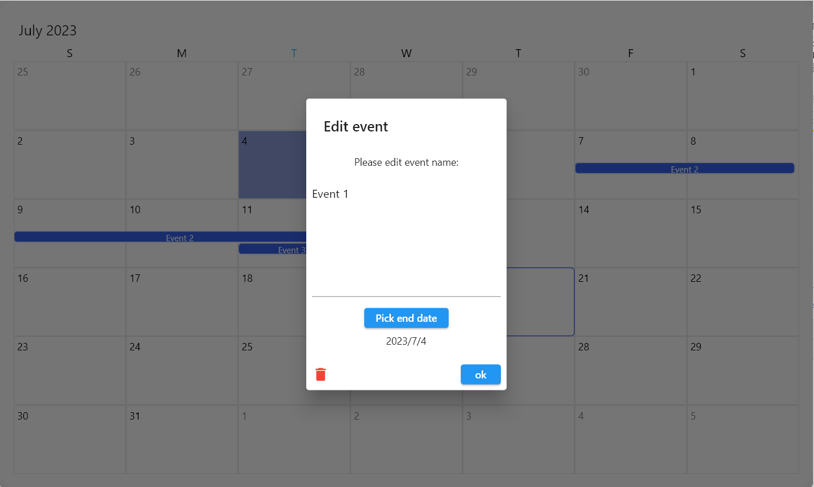

## Flutterap_event_calender
This package is extended from flutterap admin panel
Flutterap is a most developer-friendly, highly customizable admin dashboard template based on Flutter.
It comes with lots of features that make development easier for you.
<a href="https://flutterap.com" rel="nofollow">Website : flutterap.com</a>

## Features








TODO: List what your package can do. Maybe include images, gifs, or videos.

## Getting started

TODO: List prerequisites and provide or point to information on how to
start using the package.

## Usage

TODO: Include short and useful examples for package users. Add longer examples
to `/example` folder.

```dart
class MyApp extends StatelessWidget {
  const MyApp({super.key,});

  // This widget is the root of your application.
  @override
  Widget build(BuildContext context) {
    return const MaterialApp(
      debugShowCheckedModeBanner: false,
      home: Scaffold(
        body: SizedBox(

            height: 700,
            child: FxGeogorianEventCalender()),
      ),
    );
  }
}
```

